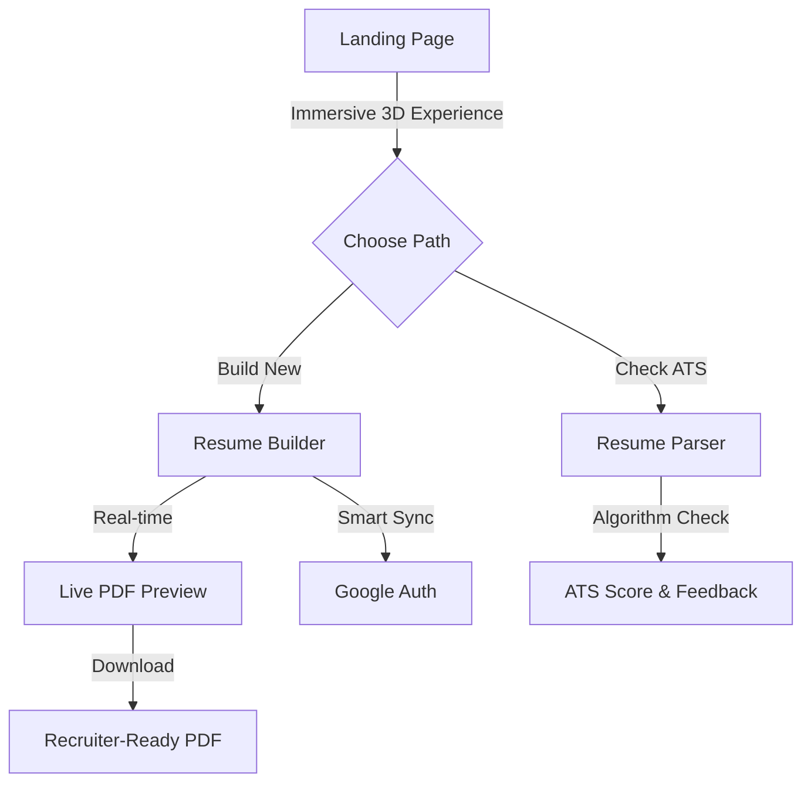

# REdge - Premium 3D Resume Builder & ATS Parser

REdge is a high-performance, professional resume builder and ATS parser designed to give job seekers a competitive edge. It combines a modern 3D storytelling experience with robust, privacy-focused resume generation tools.

## 🚀 Experience the Flow



## 💎 Premium 3D & Glassmorphism UI

The landing page features a cutting-edge **3D storytelling environment** where the resume paper flows through the viewport as you scroll, demonstrating the transition from raw data to a professional document.

- **Frosted Glass Components**: Every UI element uses advanced `backdrop-blur` techniques for a premium look.
- **Scroll-Linked Animations**: 3D elements rotate and transform in sync with your navigation.
- **Dynamic Auto-Typing**: An interactive resume preview that builds itself as you watch.

## ⚒️ Core Capabilities

### 📄 Professional Resume Builder
- **Real-Time Live Preview**: See your PDF updates instantly as you type with zero lag.
- **ATS-Optimized Templates**: Battle-tested designs that ensure your resume passes through Greenhouse, Lever, Workday, and other major ATS platforms.
- **Privacy-First Architecture**: Your data stays in your browser's local storage. No servers, no tracking, 100% privacy.
- **Smart Import**: Upload your existing PDF or JSON resume to instantly convert it into a modern, professional design.

### 🔍 ATS Resume Parser
- **Bot-Readability Check**: Verify how machines see your resume.
- **Keyword Analysis**: Ensure your content matches industry standards for higher interview conversion rates.

## 📚 Tech Stack

| Category | Choice | Description |
|---|---|---|
| **Web Framework** | [Next.js 14](https://nextjs.org/) | App Router architecture with optimized static generation. |
| **3D Rendering** | [Three.js](https://threejs.org/) | High-performance 3D graphics and scroll-linked animations. |
| **Animations** | [Framer Motion](https://www.framer.com/motion/) | Smooth UI transitions and 3D orchestration. |
| **Styling** | [Tailwind CSS](https://tailwindcss.com/) | Utility-first styling with custom Glassmorphism components. |
| **State** | [Redux Toolkit](https://redux-toolkit.js.org/) | Robust state management for complex resume data. |

## 💻 Local Development

1. **Clone & Install**:
   ```bash
   git clone <your-repo-url>
   npm install --legacy-peer-deps
   ```

2. **Setup Environment**: Create `.env.local` with your Google OAuth and EmailJS credentials.

3. **Run Dev Server**:
   ```bash
   npm run dev
   ```

---
Built with ❤️ by **Vaibhav Kumar**
